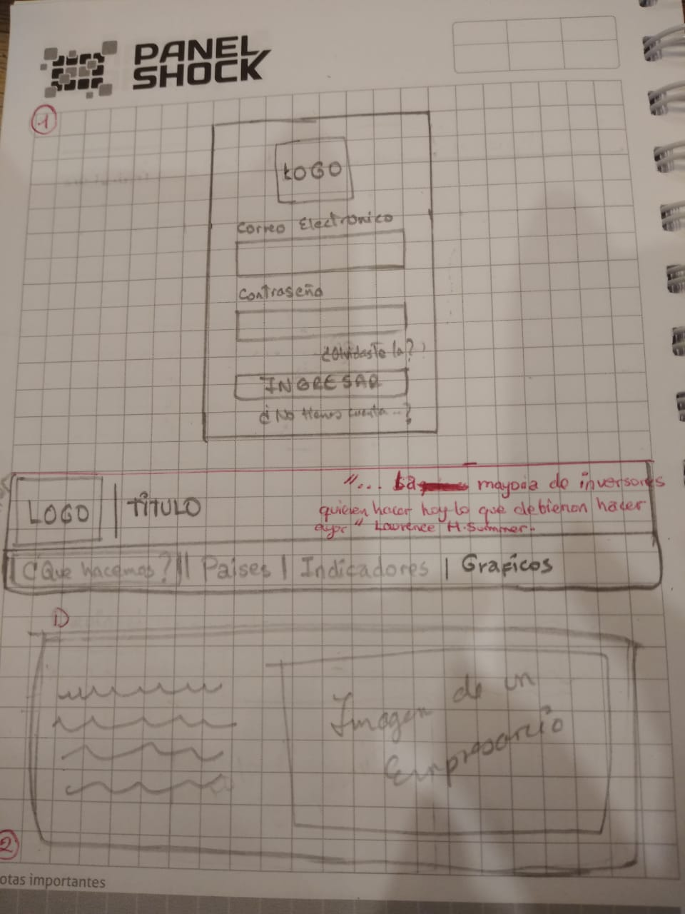
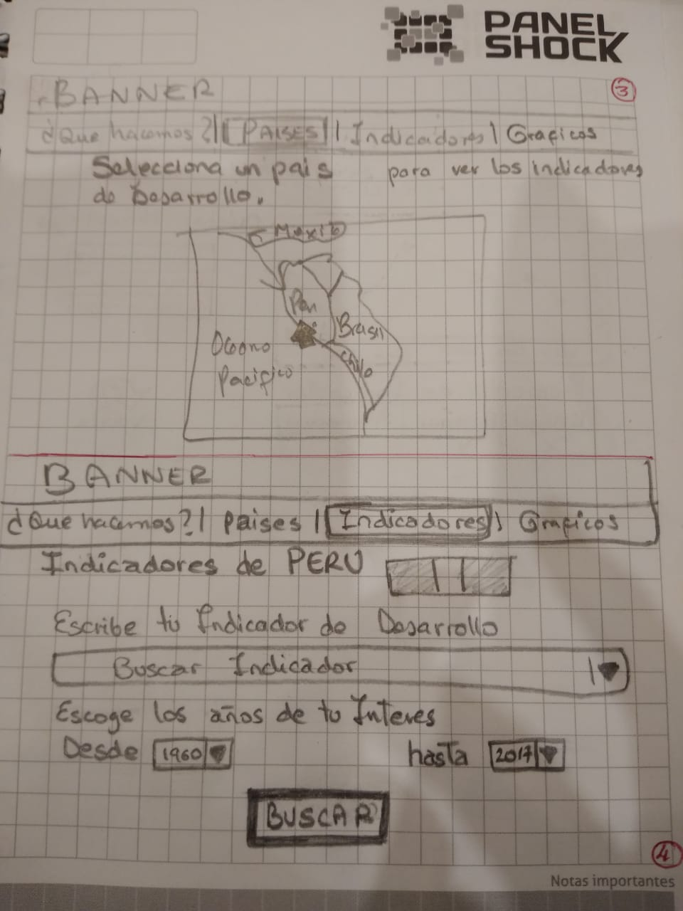
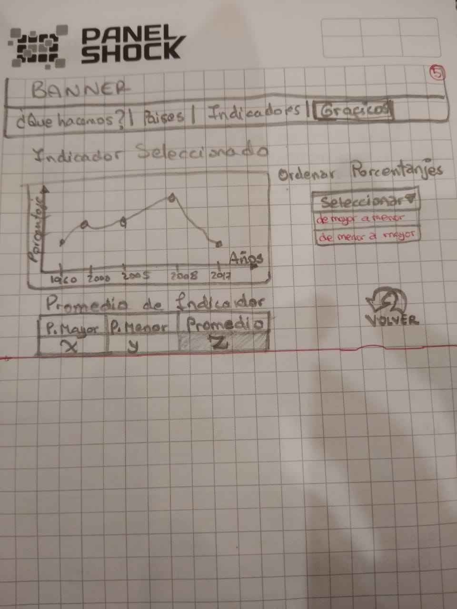
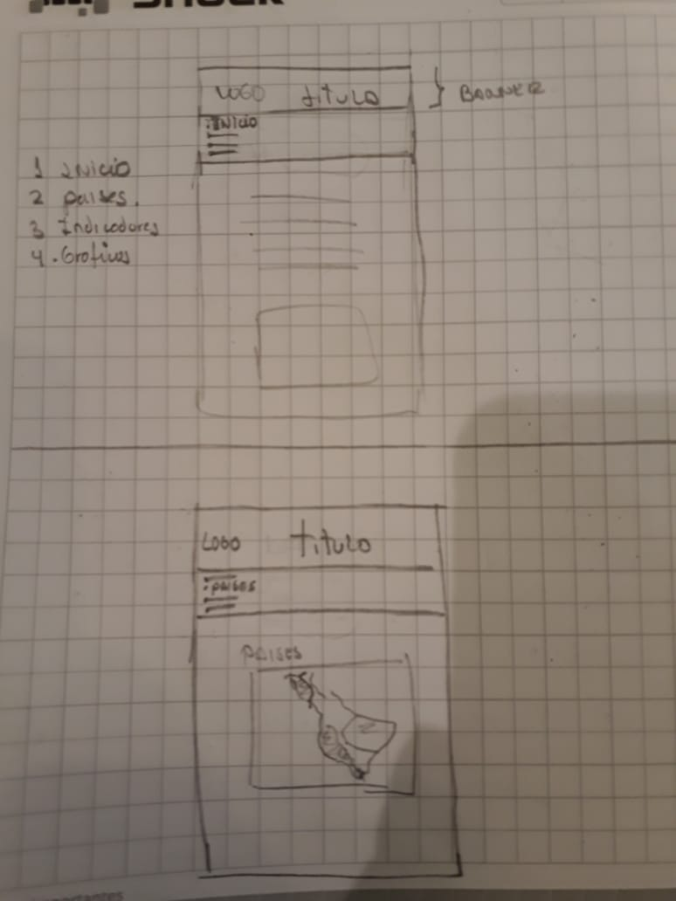
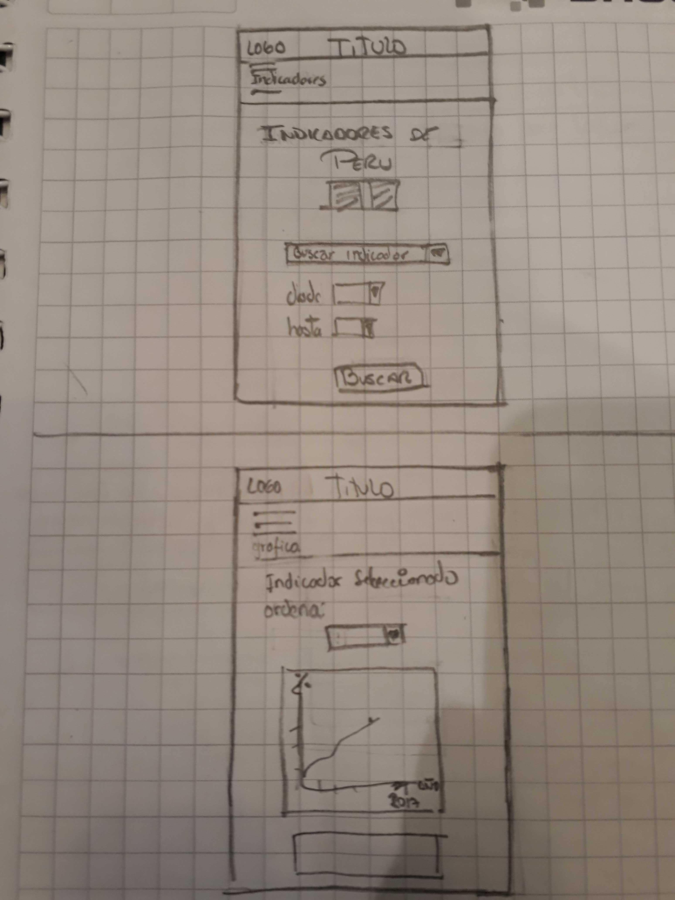

# INVESTMENT DATA

Esta aplicacion contiene indicadores de desarrollo economico, demografico y comercial de los paises: Brasil, Mexico, CHile y Peru. Esta informacion ayuda a tomar decisiones estrategicas que beneficien el interes del usuario. 
Para acceder a la aplicacion se iniciara sesion ingresando su correo electronico y contraseña "laboratoria".

- La imagen final de tu proyecto.

## Investigacion UX 
  ### Usuarios
  - Nuestros usuarios son todas las personas interesadas en el     crecimiento economico de su marca, que tienen un fin lucrativo y no lucrativo entre ellos tenemos a los empresarios, estudiantes, inversionistas, ONGs, profesionales y personas curiosas.
  ### Producto
  - Esta aplicacion te facilita la busqueda de informacion de tu interes, mostrando datos estadisticos de los indicadores seleccionados por pais las cuales son obtenidas a traves de la data del banco mundial por esto la informacion es veras y real. Teniendo esta informacion, como usuario, te ayudará a tomar mejores decisiones la cual te proporciona una ventaja al momento de invertir, e indirectamente ayudaras a disminuir los problemas economicos y sociales que aquejan a ese pais. 

  ### Prototipo de Baja Fidelidad en Desktop
   

   

   

  - Foto del primer prototipo de baja fidelidad (mobile 
  y desktop) en papel.

   ### Prototipo de Baja Fidelidad en Mobile
   

   

  - **`Feedback`**: Nos recomendaron trabajar con colores que contrastan mejor con la aplicacion, tambien nos recomendaron poner menos texto en la vista 1. 

  - Agregar un resumen del feedback recibido indicando las mejoras a realizar.

  - Imagen y link del prototipo de alta fidelidad final (mobile y desktop) en 
  Figma.

### Front-end

#### Visualmente (HTML5 y CSS3)

Deberás maquetar de forma exacta el prototipo final que hiciste en Figma 
utilizando HTML5 y CSS3.

A continuación describimos los archivos que utilizarás:

**`src/index.html`**:

En este archivo va el contenido que se mostrará al usuario (esqueleto HTML). 
Encontrarás 3 etiquetas iniciales:

- `<header>`: encabezado de tu proyecto.
- `<main>`: contenido principal de tu proyecto.
- `<footer>`: pie de página de tu proyecto.

También encontrarás una serie de _etiquetas_ (_tags_) `<script>` _comentadas_.
Para _cargar_ las diferentes fuentes de datos tendrás que _descomentar_ estas
_etiquetas_. Cada uno estos scripts asignará una variable global con la data 
correspondiente 
al set de datos selecionado.

Por ejemplo, si "descomentamos" la siguiente línea:

```html
<!-- <script src="./data/worldbank/worldbank.js"></script> -->
```

La línea quedaría así:

```html
<script src="./data/worldbank/worldbank.js"></script>
```

Y ahora tendríamos la variable global `WORLDBANK` disponible en nuestros otros
scripts (como `src/data.js` o `src/main.js`) prueba que funciona en cada 
archivo con :

```js
console.log(WORLDBANK);
```

**`src/style.css`**:

Este archivo debe contener las reglas de estilo. Queremos que escribas tus 
propias reglas, por eso NO está permitido el uso de frameworks de CSS3 (Bootstrap, 
materialize, etc).

#### Funcionalmente (JavaScript ES6 - pruebas unitarias)

- La lógica del proyecto debe estar implementada completamente en JavaScript (ES6).
- En este proyecto NO está permitido usar librerías o frameworks, sólo
[vanilla JavaScript](https://medium.com/laboratoria-how-to/vanillajs-vs-jquery-31e623bbd46e).
- No se debe utilizar la _pseudo-variable_ `this`.

Vamos a tener 2 archivos JavaScript separando responsabilidades, a continuación 
indicamos qué harás en cada archivo:

 **`src/main.js`**

En este archivo escribirás todo tu código que tenga que ver con mostrar los 
datos en la pantalla. Con esto nos referimos básicamente a la interacción 
con el DOM. Operaciones como creación de nodos, registro de manejadores de 
eventos (_event listeners_ o _event handlers_), ....

Esta no es la única forma de dividir tu código, puedes usar más archivos y
carpetas, siempre y cuando la estructura sea clara para el equipo.

**`src/data.js`**

En este archivo escribirás todo el código que contenga las funcionalidades
descritas en las historias de usuario. Estas funciones, que representan lo
que el usuario necesita, deben ser [funciones puras](https://medium.com/laboratoria-developers/introducci%C3%B3n-a-la-programaci%C3%B3n-funcional-en-javascript-parte-2-funciones-puras-b99e08c2895d) 
e independientes del DOM.

**`src/data`**

En esta carpeta están los datos de las diferentes fuentes. Encontrarás una
carpeta por cada fuente de datos, y dentro de cada carpeta dos archivos: 
uno con la extensión `.js` y otro `.json`. Ambos archivos contienen la misma 
data.

- Inicialmente solo usarás el archivo con extensión `.js`.
- Cuando tu proyecto ya esté completado, en lugar de consumir la data desde 
un archivo con extensión`.js` lo harás desde el archivo con extensión`.json` 
utilizando [`fetch()`](https://developer.mozilla.org/es/docs/Web/API/Fetch_API).

**`test/cipher.spec.js`**:

En este archivo tendrás que completar las pruebas unitarias de las funciones
implementadas en `data.js` utilizando **Jest**.
Recuerda que deberás configurar tu ambiente de trabajo para trabajar con esta 
herramienta.
Tus pruebas unitarias deben dar un 70% en _coverage_ (cobertura), _statements_
(sentencias), _functions_ (funciones) y _lines_ (líneas); y un mínimo del 50% 
de _branches_ (ramas).

## Contenido de referencia

### Diseño de experiencia de usuario (User Experience Design)

- Unidad de fundamentos de diseño visual de Visual Desing en LMS.

### Desarrollo Front-end

- Unidad de testing en curso de JavaScript en LMS.
- Unidad de arreglos en curso de JavaScript en LMS.
- Unidad de objetos en curso de JavaScript en LMS.
- Unidad de funciones en curso de JavaScript en LMS.
- Unidad de DOM en curso de Browser JavaScript en LMS.
- [Array en MDN](https://developer.mozilla.org/es/docs/Web/JavaScript/Referencia/Objetos_globales/Array)
- [Array.sort en MDN](https://developer.mozilla.org/es/docs/Web/JavaScript/Referencia/Objetos_globales/Array/sort)
- [Array.map en MDN](https://developer.mozilla.org/es/docs/Web/JavaScript/Referencia/Objetos_globales/Array/map)
- [Array.filter en MDN](https://developer.mozilla.org/es/docs/Web/JavaScript/Referencia/Objetos_globales/Array/filter)
- [Array.reduce en MDN](https://developer.mozilla.org/es/docs/Web/JavaScript/Referencia/Objetos_globales/Array/reduce)
- [Array.forEach en MDN](https://developer.mozilla.org/es/docs/Web/JavaScript/Referencia/Objetos_globales/Array/forEach)
- [Object.keys en MDN](https://developer.mozilla.org/es/docs/Web/JavaScript/Referencia/Objetos_globales/Object/keys)
- [Object.entries en MDN](https://developer.mozilla.org/es/docs/Web/JavaScript/Referencia/Objetos_globales/Object/entries)
- [Fetch API en MDN](https://developer.mozilla.org/en-US/docs/Web/API/Fetch_API)
- [json.org](https://json.org/json-es.html)

### Herramientas

- [Git](https://git-scm.com/)
- [GitHub](https://github.com/)
- [GitHub Pages](https://pages.github.com/)
- [Node.js](https://nodejs.org/)
- [Jest](https://jestjs.io/)

### Organización del Trabajo:

- [Historias de Usuario](https://www.youtube.com/watch?v=ky6wFiF5vMk&t=344s)
- [Cómo dividir H.U.](https://www.youtube.com/watch?v=Ueq786iZ30I&t=341s)
- [Definiciones de terminado](https://www.scrum.org/resources/blog/definicion-de-terminado-done)
- [Criterios de aceptación](https://pabloquilca.com/criterios-de-aceptacion/)
- [Github plannig](https://www.youtube.com/watch?v=RXEy6CFu9Hk)
